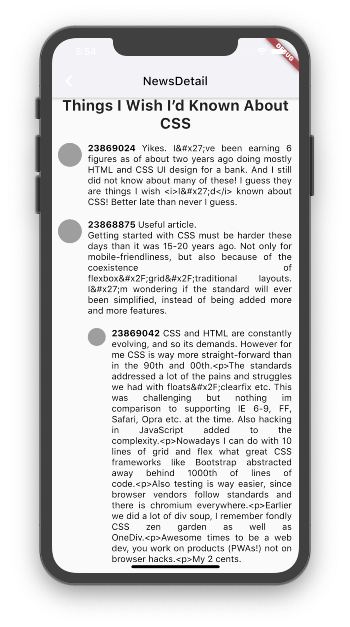
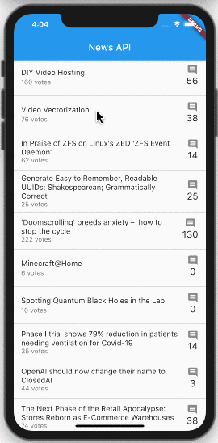
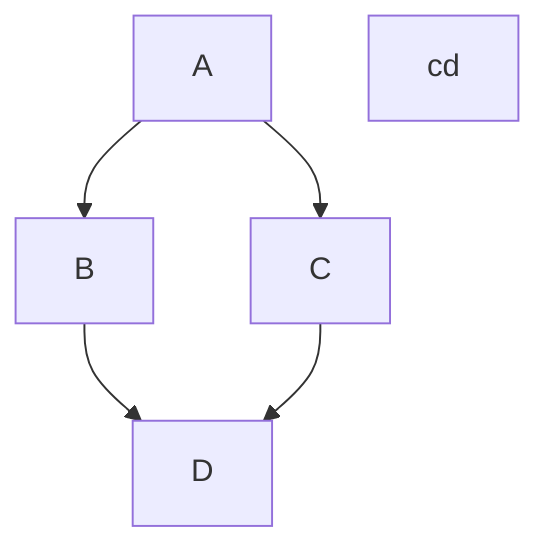

# HackerNews API and sqflite package
Flutter Project About:
 - sqflite implementation (local database cache).
 - BLoC and Provider.
 - Reading API and consume it.
 - gray loading area.
 - comment depth/tree indentation.
 
#### ScreenShot

xcrun simctl io <Sim Device ID> recordVideo
